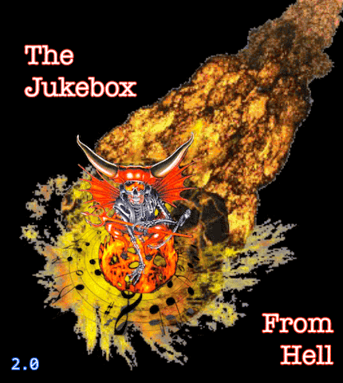

# Jukebox From Hell



Scrapes songs off the internet for you, nothing you couldn't have clicked on yourself. Type anything — a song, an artist, a mood, a vibe — and the jukebox finds it and starts playing in seconds.

## How It Works

1. You type something into the search box
2. yt-dlp searches YouTube and extracts a direct audio stream URL (~2 seconds)
3. The audio is proxied through the server and streams to your browser immediately
4. No files are downloaded or stored on disk

## Stack

- **Backend:** FastAPI, Python 3.12, Gunicorn + Uvicorn async workers
- **Music:** yt-dlp (stream URL extraction, no download)
- **Frontend:** Tailwind CSS, vanilla JS, Web Audio API visualizer
- **Container:** Docker, python:3.12-slim + ffmpeg

## Run It

```bash
docker compose up --build
```

Then open [http://localhost:8000](http://localhost:8000).

## Shut It Down

```bash
docker compose down
```

To also remove the images built by compose:

```bash
docker compose down --rmi local
```

## Disclaimer

It also errors out and times out, and just plain fails. In the event that happens, please try again. There is no need to let me know about the failure because:

- a) I have logs.
- b) I don't care.

You get what you pay for, and if you pay nothing? Well that is probably because you are the product. The cow doesn't get to complain how the steak gets served, moove along.

## Credits

Shamelessly copied from the hard work MD5HashBrowns did on [Apollo Cloud](https://github.com/MD5HashBrowns/apollo-cloud), built off of Craicerjack's apache-flask docker image with a sprinkle of [yt-dlp](https://github.com/yt-dlp/yt-dlp) for some awesomeness.

## License

MIT
